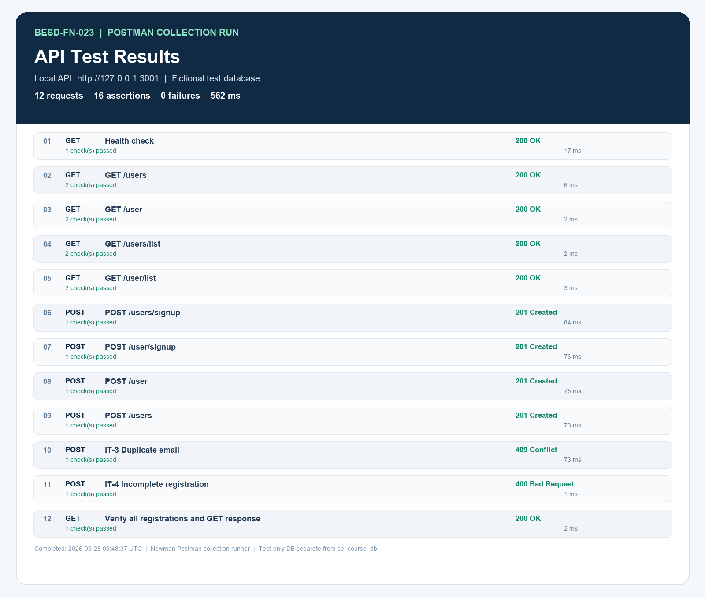

# BESD-FN-023

A short-course registration API built with Express.js and MySQL. It supports user registration and listing, hashes passwords, and returns calculated ages. Student ID: **b671103023**.

## Run locally

```sh
cp .env.example .env   # configure local database credentials if needed
docker compose up -d db
npm install
npm start
```

The API runs at `http://localhost:3000` by default. To prepare and run the separate Postman test database on port 3001:

```sh
docker compose exec -T db mysql -uroot -plocal-root-password < sql/postman-test-db.sql
DB_NAME=se_course_postman_db PORT=3001 npm start
```

Run the Postman collection with Newman in another terminal:

```sh
npm run test:postman
```

## API URLs

Base URL: `http://localhost:3000` (or `http://localhost:3001` for the Postman test setup)

| Method | URL | Purpose |
|---|---|---|
| GET | `/health` | Service health |
| GET | `/users` | List users |
| GET | `/user` | List users (singular alias) |
| GET | `/users/list` | List users |
| GET | `/user/list` | List users (singular alias) |
| POST | `/users` | Register a user |
| POST | `/user` | Register a user (singular alias) |
| POST | `/users/signup` | Register a user |
| POST | `/user/signup` | Register a user (singular alias) |

## Postman results

Latest captured run: **12 requests, 16 assertions, 0 failures**.

[Open the Postman results image](public/postman-run-results.png)



Detailed JSON, HTML, and log reports are in [`test-report/postman-results/`](test-report/postman-results/).
